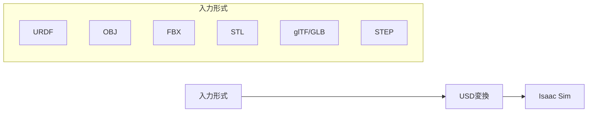

# NVIDIA Brev で Isaac Sim + cuRobo を用いた UR5 経路最適化環境

NVIDIA Brev上でIsaac Sim 5.1.0とcuRoboを使用してUR5ロボットの経路最適化を行うためのセットアップガイドです。

## 概要

このリポジトリは、最小限の構成でIsaac Sim + cuRobo環境を構築するためのスクリプト集です。

### 特徴

- **軽量**: 必要最小限の構成
- **低コスト**: L40S 1台で動作
- **シンプル**: docker-compose不要、直接docker runで起動

### ファイル構成

```
brev-isaac-ur5-setup/
├── README.md                 # この手順書
├── setup.sh                  # 初期セットアップスクリプト
├── start-container.sh        # コンテナ起動スクリプト
└── scripts/
    ├── start-streaming.sh    # Isaac Simストリーミング起動（コンテナ内用）
    └── install-curobo.sh     # cuRoboインストール（コンテナ内用）
```

---

## 前提条件

- NVIDIA Brevアカウント
- Isaac Sim WebRTC Streaming Clientアプリ
  - ダウンロード: https://github.com/isaac-sim/IsaacSim/releases

---

## セットアップ手順

### 1. Brevインスタンスの作成

1. [NVIDIA Brev](https://developer.nvidia.com/brev) にアクセス・ログイン
2. **Create New Instance** をクリック
3. **1x NVIDIA L40S** GPUを選択
4. インスタンスに名前を付けて **Deploy**
5. VMの準備完了まで待機

### 2. ポートの開放（重要）

Brevダッシュボードの **TCP/UDP Ports** セクションで以下を開放：

| ポート | プロトコル | 用途 |
|--------|------------|------|
| **49100** | TCP | WebRTC シグナリング |
| **47998** | **UDP** | WebRTC ストリーミング |

> ⚠️ **47998はUDPで開放してください。TCPでは動作しません。**

### 3. このリポジトリのクローンとセットアップ

```bash
# SSHでBrevインスタンスに接続後
git clone https://github.com/<your-username>/brev-isaac-ur5-setup.git
cd brev-isaac-ur5-setup
chmod +x *.sh scripts/*.sh

# セットアップ実行（cuRoboクローン、ディレクトリ作成、コンテナプル）
./setup.sh
```

### 4. Isaac Simコンテナの起動

```bash
./start-container.sh
```

### 5. Isaac Simをストリーミングモードで起動（コンテナ内）

```bash
bash /scripts/start-streaming.sh
```

### 6. 起動完了を確認

以下のメッセージが表示されるまで待つ（初回は数分かかります）：

```
Isaac Sim Full Streaming App is loaded.
```

### 7. WebRTC Streaming Clientで接続

1. **Isaac Sim WebRTC Streaming Client** を起動
2. **Server** 欄にBrevインスタンスのパブリックIPを入力
3. **Connect** をクリック

---

## UR5ロボットの配置

Isaac SimにはUR5/UR5eのアセットが標準で含まれています。以下の方法でシーンに配置できます。

### 方法1: GUIから配置

1. Isaac Simの画面上で **Create > Isaac > Robots > From Library** を選択
2. **Manipulators** カテゴリから **Universal Robots** を選択
3. **UR5** または **UR5e** を選択してシーンに配置

### 方法2: Script Editorから配置

1. **Window > Script Editor** を開く
2. 以下のコードを貼り付けて実行：

```python
from isaacsim.core.utils.stage import add_reference_to_stage
from isaacsim.storage.native import get_assets_root_path

# アセットパスを取得
assets_root = get_assets_root_path()

# UR5eをシーンに追加
ur5e_path = assets_root + "/Isaac/Robots/UniversalRobots/ur5e/ur5e.usd"
add_reference_to_stage(usd_path=ur5e_path, prim_path="/World/UR5e")
```

### 方法3: Content Browserから配置

1. **Window > Browsers > Isaac Sim Assets** を開く
2. **Robots > UniversalRobots** に移動
3. `ur5e.usd` をステージにドラッグ＆ドロップ

### UR5の位置・姿勢の調整

配置後、Property Panelまたはスクリプトで位置を調整：

```python
from pxr import UsdGeom, Gf
import omni.usd

stage = omni.usd.get_context().get_stage()
prim = stage.GetPrimAtPath("/World/UR5e")

# 位置を設定 (x, y, z)
xform = UsdGeom.Xformable(prim)
xform.AddTranslateOp().Set(Gf.Vec3f(0.0, 0.0, 0.0))

# 回転を設定 (度単位: X, Y, Z)
xform.AddRotateXYZOp().Set(Gf.Vec3f(0.0, 0.0, 0.0))
```

### 利用可能なURロボットアセット

Isaac Simには以下のUniversal Robotsモデルが含まれています：

| モデル | パス |
|--------|------|
| UR3 | `/Isaac/Robots/UniversalRobots/ur3/ur3.usd` |
| UR3e | `/Isaac/Robots/UniversalRobots/ur3e/ur3e.usd` |
| UR5 | `/Isaac/Robots/UniversalRobots/ur5/ur5.usd` |
| UR5e | `/Isaac/Robots/UniversalRobots/ur5e/ur5e.usd` |
| UR10 | `/Isaac/Robots/UniversalRobots/ur10/ur10.usd` |
| UR10e | `/Isaac/Robots/UniversalRobots/ur10e/ur10e.usd` |
| UR16e | `/Isaac/Robots/UniversalRobots/ur16e/ur16e.usd` |

---

## カスタム3Dモデルの導入

Isaac Simでは様々な形式の3Dモデルをインポートできます。

### 対応フォーマット



| 形式 | 用途 | インポート方法 |
|------|------|----------------|
| **URDF** | ロボット定義 | File > Import |
| **OBJ** | 3Dメッシュ | File > Import または Asset Converter |
| **FBX** | 3Dメッシュ（アニメーション対応） | File > Import |
| **STL** | CADメッシュ | File > Import |
| **glTF/GLB** | Web3Dフォーマット | Asset Converter |
| **STEP** | CADフォーマット | File > Import |

### 方法1: GUIからインポート（推奨）

#### メッシュファイル（OBJ/FBX/STL）の場合

1. **File > Import** を選択
2. ファイルを選択
3. インポートオプションを設定：
   - **Create Physics**: 物理シミュレーション用のコリジョンを追加
   - **Import Materials**: マテリアルを含める
4. **Import** をクリック

#### URDFファイルの場合

1. **File > Import** を選択
2. URDFファイルを選択
3. インポートオプションを設定：
   - **Static Base**: 固定ベース（マニピュレータ向け）
   - **Moveable Base**: 移動可能ベース（移動ロボット向け）
   - **Self Collision**: 自己衝突チェックを有効化
4. **Import** をクリック

### 方法2: Pythonスクリプトからインポート

#### URDFのインポート

```python
from isaacsim.asset.importer.urdf import _urdf
import omni.kit.commands

# URDFインターフェースを取得
urdf_interface = _urdf.acquire_urdf_interface()

# インポート設定
import_config = _urdf.ImportConfig()
import_config.merge_fixed_joints = False
import_config.fix_base = True  # ベースを固定
import_config.self_collision = True

# URDFをインポート
result, prim_path = omni.kit.commands.execute(
    "URDFParseAndImportFile",
    urdf_path="/path/to/robot.urdf",
    import_config=import_config,
    dest_path="/World/MyRobot"
)
```

#### メッシュのインポート

```python
from isaacsim.core.utils.stage import add_reference_to_stage

# 既にUSD形式の場合
add_reference_to_stage(
    usd_path="/path/to/model.usd",
    prim_path="/World/MyObject"
)
```

### 方法3: Asset Converterを使用（バッチ変換）

大量のメッシュファイルをUSDに変換する場合：

```bash
# Isaac Sim のPython環境で実行
cd /isaac-sim
./python.sh -c "
from omni.kit.asset_converter import AssetConverterContext
import asyncio

async def convert():
    converter_context = AssetConverterContext()
    await converter_context.convert(
        input_path='/path/to/model.obj',
        output_path='/path/to/output.usd'
    )

asyncio.get_event_loop().run_until_complete(convert())
"
```

### インポート後の設定

#### 物理プロパティの追加

インポートしたモデルに物理シミュレーション機能を追加：

1. モデルを選択
2. **Property Panel** で **Add > Physics** を選択
3. 以下を追加：
   - **Rigid Body**: 剛体物理
   - **Collision**: 衝突判定
   - **Mass**: 質量設定

#### Articulation（関節構造）の設定

ロボットとして動かす場合：

1. ルートプリムを選択
2. **Property Panel** で **Add > Physics > Articulation Root** を追加
3. 各ジョイントの設定を確認・調整

### ファイル構成のベストプラクティス

カスタムアセットを整理する推奨構成：

```
~/custom_assets/
├── robots/
│   ├── my_robot/
│   │   ├── urdf/
│   │   │   └── my_robot.urdf
│   │   ├── meshes/
│   │   │   ├── visual/
│   │   │   └── collision/
│   │   └── usd/
│   │       └── my_robot.usd
├── objects/
│   ├── table.usd
│   └── box.usd
└── environments/
    └── factory.usd
```

### カスタムアセットをコンテナにマウント

`start-container.sh` を編集してカスタムアセットディレクトリを追加：

```bash
docker run --name isaac-sim \
    # ... 既存のオプション ...
    -v ~/custom_assets:/custom_assets:ro \
    # ...
```

コンテナ内からは `/custom_assets` でアクセス可能になります。

---

## cuRoboのインストール（UR5経路最適化に必要）

コンテナ内で実行：

```bash
bash /scripts/install-curobo.sh
```

### cuRoboの動作確認

```bash
cd /curobo
/isaac-sim/python.sh examples/isaac_sim/motion_gen_reacher.py --robot ur5e.yml
```

---

## 日常の使用方法

### Isaac Simの起動（毎回）

```bash
# ホスト側
cd brev-isaac-ur5-setup
./start-container.sh

# コンテナ内
bash /scripts/start-streaming.sh
```

### UR5モーション生成の実行

Isaac Sim起動後、別ターミナルでコンテナに入って実行：

```bash
# ホスト側から別ターミナルでコンテナに入る
docker exec -it isaac-sim bash

# コンテナ内でモーション生成実行
cd /curobo
/isaac-sim/python.sh examples/isaac_sim/motion_gen_reacher.py --robot ur5e.yml --visualize_spheres
```

---

## トラブルシューティング

### WebRTC Clientで接続できない

1. **ポート確認**: 49100(TCP)と47998(UDP)が開放されているか確認
2. **起動完了確認**: `Isaac Sim Full Streaming App is loaded.` が表示されているか確認
3. **IP確認**: 正しいパブリックIPを入力しているか確認

ホスト側でポート確認：
```bash
ss -tlnp | grep 49100  # TCPポート
ss -ulnp | grep 47998  # UDPポート
```

### cuRoboインストールエラー

```bash
# PyTorchバージョン確認
/isaac-sim/python.sh -c "import torch; print(torch.__version__)"
```

---

## コスト最適化のヒント

1. **使用後は必ずインスタンスを停止** - Brevダッシュボードから **Stop** をクリック
2. **キャッシュの活用** - 2回目以降の起動は高速化されます
3. **必要な時だけ起動** - ヘッドレス処理中はストリーミング不要

---

## ライセンス

- Isaac Sim: [NVIDIA Omniverse License Agreement](https://docs.omniverse.nvidia.com/platform/latest/common/NVIDIA_Omniverse_License_Agreement.html)
- cuRobo: 非商用目的のみ（商用利用はNVIDIAへの問い合わせが必要）

---

## 参考リンク

- [Isaac Sim Documentation](https://docs.isaacsim.omniverse.nvidia.com/)
- [Isaac Sim Livestream Clients](https://docs.isaacsim.omniverse.nvidia.com/5.1.0/installation/manual_livestream_clients.html)
- [Robot Assets](https://docs.isaacsim.omniverse.nvidia.com/latest/assets/usd_assets_robots.html) - 組み込みロボットアセット一覧
- [URDF Importer](https://docs.isaacsim.omniverse.nvidia.com/latest/robot_setup/ext_isaacsim_asset_importer_urdf.html) - URDFインポート詳細
- [Working with USD](https://docs.isaacsim.omniverse.nvidia.com/5.1.0/omniverse_usd/intro_to_usd.html) - USD形式の基礎
- [cuRobo Documentation](https://curobo.org/)
- [NVIDIA Brev](https://developer.nvidia.com/brev)
